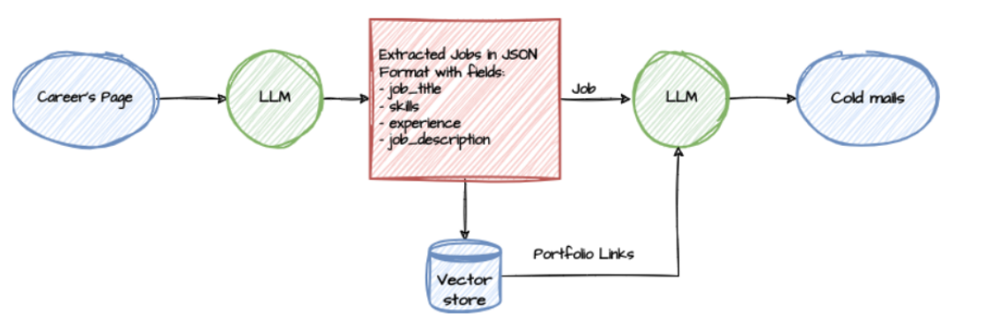
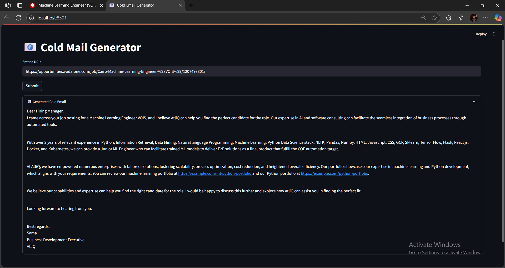

# 📧 Cold Mail Generator

A smart cold email generator for service companies using Groq, LangChain, and Streamlit. This tool extracts job listings from company career pages and generates personalized cold emails with relevant portfolio links.



## ✨ Features

- **Automated Job Extraction**: Scrapes and extracts job details (role, experience, skills, description) from career pages
- **Personalized Email Generation**: Creates tailored cold emails based on job requirements
- **Portfolio Matching**: Uses vector database to find relevant portfolio links matching job skills
- **Streamlit UI**: User-friendly interface for easy interaction
- **LangChain Integration**: Leverages LLM capabilities for content generation

## 🧰 Technologies Used

- Python
- Streamlit – Web interface
- LangChain – LLM orchestration
- Groq – High-performance LLM API
- ChromaDB – Vector database for portfolio matching
- BeautifulSoup – Web scraping

## 📁 Folder Structure

```
COLD-MAIL-GENERATOR/
│
├── app/
│   ├── __pycache__/
│   ├── resource/
│   ├── chains.py          # LLM chains for job extraction and email generation
│   ├── main.py            # Streamlit application
│   ├── portfolio.py       # Portfolio vector database management
│   └── utils.py           # Text cleaning utilities
│
├── requirements.txt       # Dependencies
├── README.md              # Documentation
└── architecture.png       # System architecture diagram
```

## 🚀 Getting Started

### Prerequisites

1. Obtain a Groq API key from [Groq Console](https://console.groq.com/keys)
2. Python 3.8 or higher

### Installation

1. Clone the repository:
   ```bash
   git clone https://github.com/SamaQaraa/Cold-Mail-Generator.git
   cd Cold-Mail-Generator
   ```

2. Create and activate a virtual environment (recommended):
   ```bash
   python -m venv venv
   source venv/bin/activate  # On Windows use `venv\Scripts\activate`
   ```

3. Install dependencies:
   ```bash
   pip install -r requirements.txt
   ```

4. Create a `.env` file in the `app` directory with your Groq API key:
   ```
   GROQ_API_KEY=your_api_key_here
   ```

### Usage

Run the Streamlit application:
```bash
streamlit run app/main.py
```

The application will open in your default browser. Enter the URL of a company's careers page and click "Submit" to generate cold emails for the available job postings.

## 📝 How It Works

1. **Input**: User provides a URL to a company's careers page
2. **Scraping**: The tool extracts and cleans the page content
3. **Job Extraction**: LLM processes the text to identify job postings and extracts key details
4. **Portfolio Matching**: Vector database queries find relevant portfolio links based on job skills
5. **Email Generation**: LLM creates personalized cold emails incorporating job details and portfolio links
6. **Output**: Generated emails are displayed in the interface

## 📋 Sample Generated Email

Here's an example output generated by the system:



**Key components demonstrated:**
- Personalized subject line referencing the job title
- Direct address to the potential client's needs
- Relevant skills and technologies highlighted
- Portfolio examples matched to the job requirements
- Professional closing with contact information

## 🚦 Example Usage

1. Visit a careers page like Nike's job listings
2. Copy the URL of a relevant job posting
3. Paste into the Cold Mail Generator
4. Get a tailored email like the sample above


